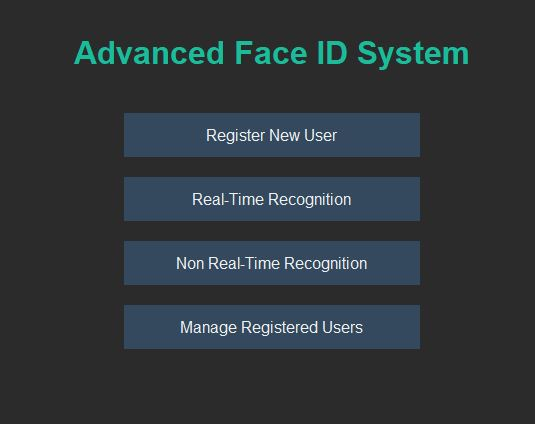
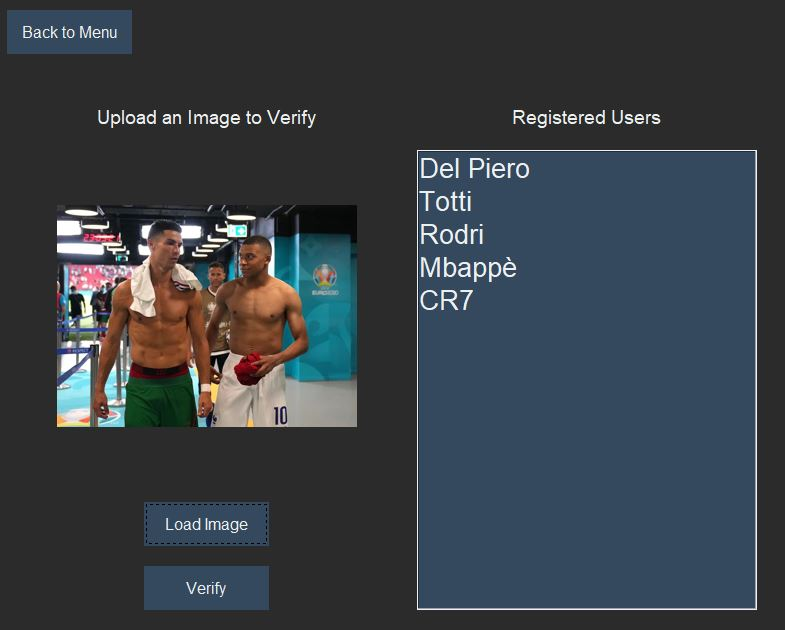
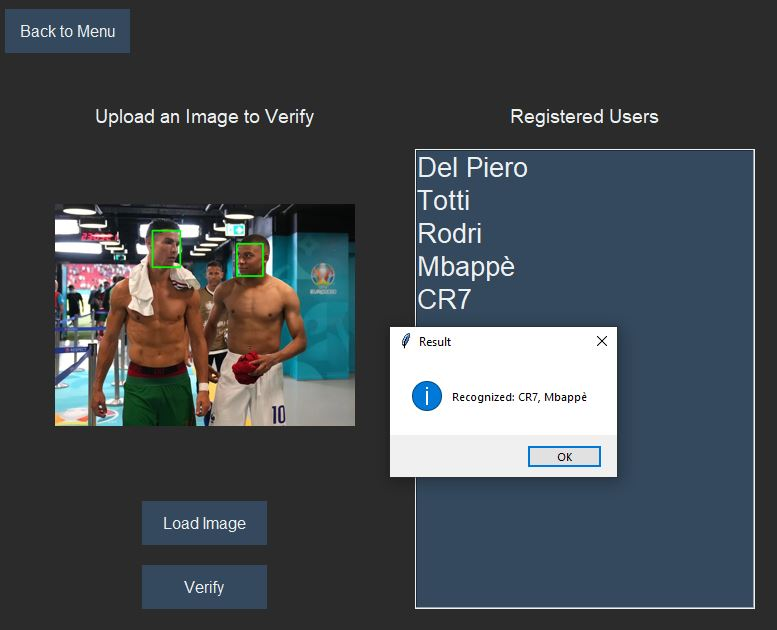
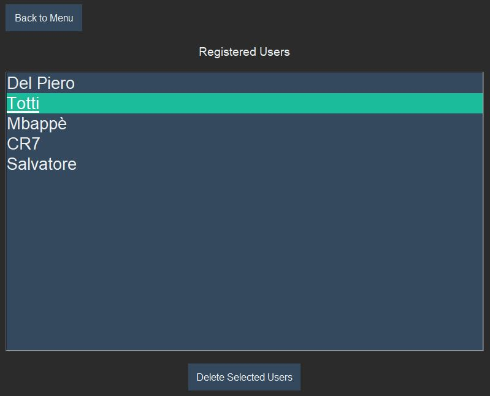
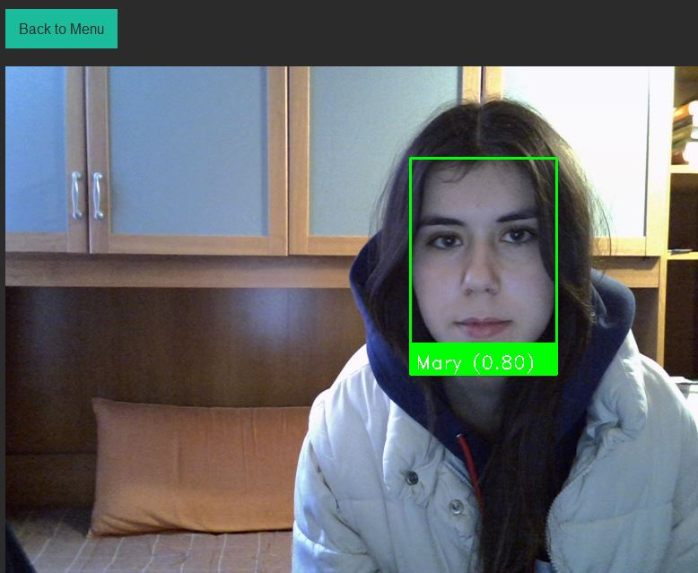

# Advanced Face Recognition System

**Advanced Face Recognition System** is a sophisticated desktop application developed in Python using the Tkinter library and InsightFace for facial recognition. The system offers both real-time and non-real-time face recognition capabilities, with an intuitive user interface and comprehensive user management features.

## Features

### Registration
- Register new users using at least 3 face images
- Automatic face embedding calculation and storage
- Support for multiple face angles and expressions

### Real-Time Recognition
- Live webcam face detection and recognition
- Real-time identity verification
- Visual feedback with bounding boxes and confidence scores
- Color-coded recognition status (green for known faces, red for unknown)

### Non Real-Time Recognition
- Upload and analyze static images
- Support for multiple faces in a single image
- Detailed recognition results with similarity scores
- Visual feedback with highlighted face areas

### User Management
- View all registered users
- Delete single or multiple users

## Dependencies

To run the project, the following libraries are required:

- Python 3.x
- Tkinter (usually comes with Python)
- OpenCV (cv2)
- NumPy
- PIL (Python Imaging Library)
- InsightFace
- scikit-learn
- threading (built-in)
- pickle (built-in)

You can install the required dependencies using pip:

```bash
pip install opencv-python numpy pillow insightface scikit-learn
```

## Installation

1. Clone or download this repository
2. Ensure Python 3.x is installed on your system
3. Install the required dependencies as described above
4. Ensure you have a working webcam for real-time recognition
5. Run the application

## How to Use

Run the main file:

```bash
python face_recognition_app.py
```

From the main menu, you can:

### Register New User
- Select at least 3 different face images of the user
- Enter the user's name
- Wait for registration confirmation

### Real-Time Recognition
- Position face in front of webcam
- View real-time recognition results
- Click "Back to Menu" to exit

### Non Real-Time Recognition
- Load an image using "Load Image"
- Click "Verify" to analyze faces
- View recognition results

### Manage Registered Users
- View all registered users
- Select users to delete
- Confirm deletions

## Technical Details

### Face Recognition Process

1. **Face Detection**
   - Uses InsightFace's buffalo_l model
   - Detects faces in images or video frames
   - Extracts face coordinates

2. **Face Embedding**
   - Generates 512-dimensional face embeddings
   - Uses cosine similarity for face matching
   - Implements a similarity threshold of 0.6

3. **User Registration**
   - Stores average embeddings from multiple images
   - Saves data in a pickle file for persistence
   - Validates face presence in registration images


## Data Storage

The application stores face embeddings in a local file:
- File name: `embeddings.pkl`
- Format: Python pickle format
- Content: Dictionary of user names and face embeddings
- Auto-saves after registration/deletion

## Screenshots
### Menu


### Non Real-Time Recognition (Webcam source)




### Manage Registered Users


### Real-Time Recognition



## Contributions

Contributions are welcome! Feel free to:
- Open issues for bugs or suggestions
- Submit pull requests with improvements
- Help with documentation
- Share your experience using the system

## License

This project is licensed under the MIT License --->  [](https://opensource.org/licenses/MIT)