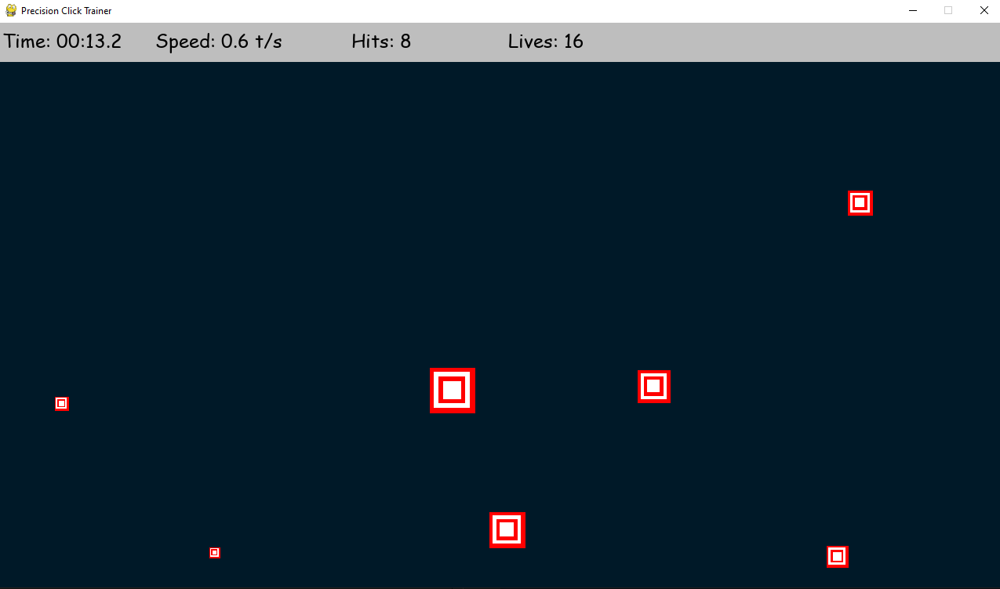

# Precision Click Trainer

**Precision Click Trainer** is a game developed in Python using the Pygame library, designed to improve the user's click precision and speed. The game challenges players to hit moving targets before they disappear, with detailed statistics and various customization options.

---

## Features

### Main Game Mode:
- Targets appear in random positions on the screen.
- The targets grow and then shrink until they disappear.
- Click on the targets before they disappear to score points.
- Every missed target reduces the number of remaining lives.

### Main Menu:
- Select the difficulty level with different target spawn speeds: `Very Easy`, `Easy`, `Medium`, `Hard`, `Very Hard`.
- Customize the background color.
- Enable or disable game sounds.

### Game Statistics:
- Time spent.
- Average click speed (targets per second).
- Number of targets hit.
- Accuracy percentage.
- Remaining lives.

### Custom Sound Effects:
- Click sound when a target is hit.
- Error sound when a target is missed.
- Game over sound.

### Scoring System and End of Game:
- Final statistics at the end of the game (time, accuracy, speed, and hits).
- Intuitive graphical interface with custom buttons and menus.

---

## Dependencies

To run the project, the following libraries are required:

- Python 3.x
- Pygame

You can install it by running:

```bash
pip install pygame
```

---

## Installation

1. Clone or download this repository.
2. Ensure Python 3 is installed.
3. Install the required dependencies as described above.
4. Place the audio files (`click.wav`, `miss.wav`, `game_over.wav`) in the `sounds` folder in the same directory as the script.

---

## How to Play

Run the main file:

```bash
python Precision_click_trainer.py
```

From the main menu:
- Select the difficulty level.
- Choose the background color.
- Enable or disable the sounds.
- Click on "Play" to start the game.

During the game:
- Hit the targets by clicking on them.
- Avoid letting them disappear to preserve your lives.
- At the end of the game, view your final statistics.

---

## Difficulty Levels

- **Very Easy**: Targets appear every 2000 ms.
- **Easy**: Targets appear every 1000 ms.
- **Medium**: Targets appear every 600 ms.
- **Hard**: Targets appear every 400 ms.
- **Very Hard**: Targets appear every 200 ms.

---

## Customizations

### Available Background Colors:
- Purple
- Orange
- Blue
- Red

### Audio Options:
- Enable or disable the game sound effects.

---

## Code Structure

### Main Classes:

- **Target**: Represents a target on the screen. Handles growth, shrinking, drawing, and collision with the mouse cursor.
- **Button**: Represents an interactive button in the menu. Supports hover, click, and graphical customizations.

### Main Functions:

- **main_menu()**: Manages the initial menu with customization options.
- **main()**: Main game loop.
- **draw()**: Draws the background and active targets.
- **draw_top_bar()**: Displays real-time statistics during the game.
- **end_screen()**: Shows the final statistics at the end of the game.

---

## Sounds

The following audio files should be placed in the `sounds` folder:

- **click.wav**: Played when a target is hit.
- **miss.wav**: Played when a target is missed.
- **game_over.wav**: Played when lives run out.

You can replace the audio files with others, as long as they have the same name and are in `.wav` format.

---

## Screenshots





---

## Contributions

If you'd like to contribute to the project, feel free to open a pull request or report issues in the Issues section.

---

## License
This project is licensed under the MIT License --->  [](https://opensource.org/licenses/MIT)
